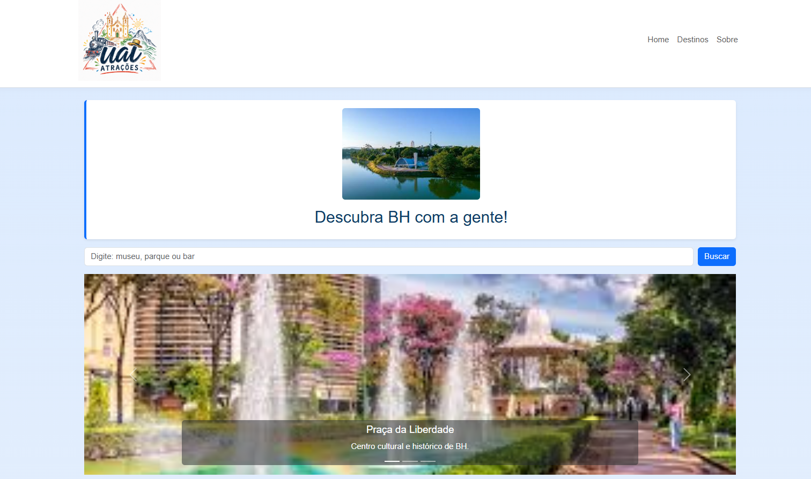
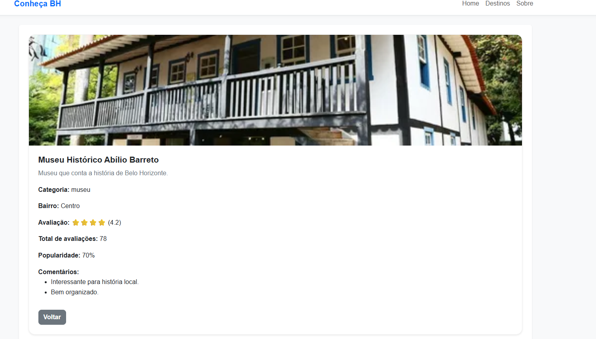

Conheça BH - Site de Turismo em BH - MG

O site apresenta pontos turísticos, parques, museus e bares de Belo Horizonte, permitindo que o usuário visualize locais em destaque e acesse páginas de detalhes de cada destino.

---

Informações da Aluna

- Nome: Patricia de Souza
- Matrícula: 901262

---

Funcionalidades

O site possui:

- Página inicial dinâmica
- Cards criados com JavaScript
- Página de detalhes
- Navegação usando Query String

---

Prints do Projeto

Página Inicial



Página de Detalhes



---

Exemplo do JSON Utilizado

```js
{
  id: 1,
  nome: "Museu das Minas e do Metal",
  categoria: "museu",
  bairro: "Centro"
}
```
